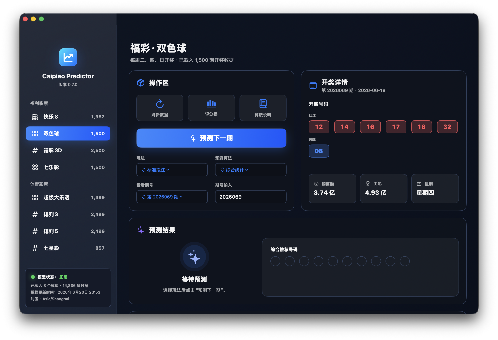
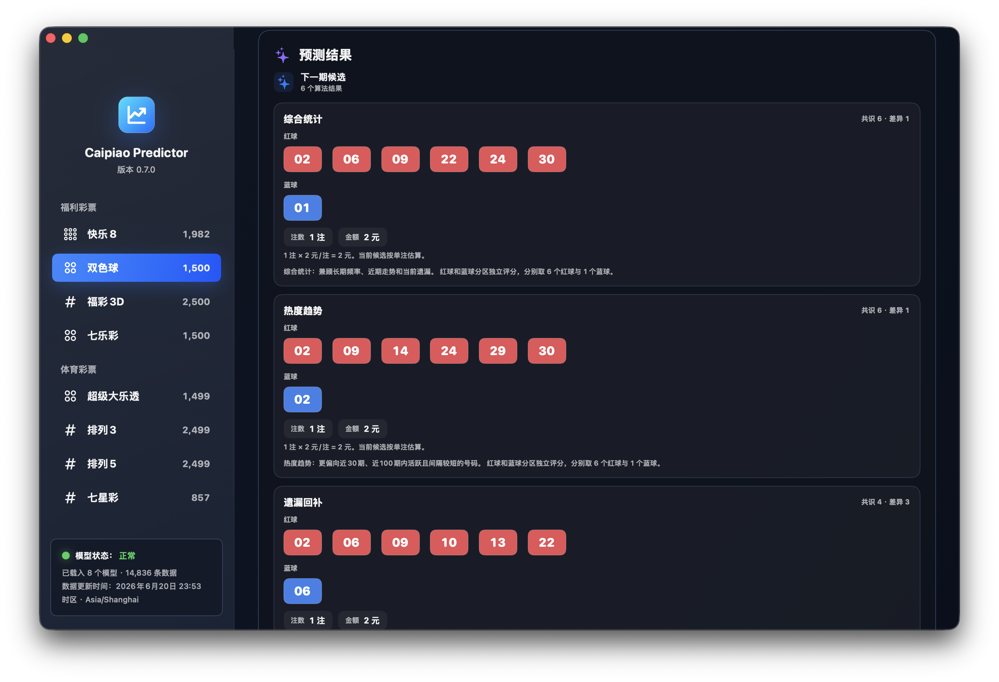
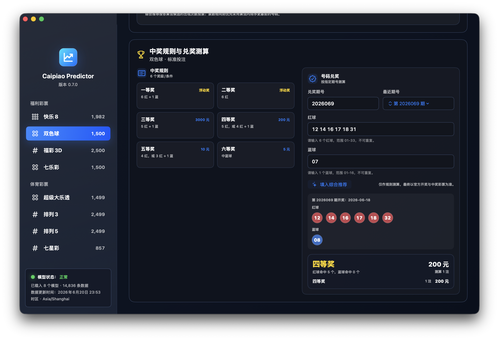

# 彩票预测工作台

这是一个面向 macOS 的原生 SwiftUI 彩票数据工作台，包含历史开奖数据抓取、统计建模、候选号码生成、中奖规则查看和指定期号兑奖测算功能。

> 重要提醒：彩票开奖结果应视为独立随机事件。本项目用于数据分析、建模练习和规则查询，不构成中奖承诺，也不建议超预算投注。

## 功能概览

- 支持 中国福利彩票：快乐8、双色球、福彩3D、七乐彩
- 支持 中国体育彩票：超级大乐透、排列3、排列5、七星彩
- 启动时载入内置历史开奖数据
- 支持更新当前彩种或全部彩种数据
- 支持选择玩法和历史期号
- 支持多算法预测下一期候选号码
- 支持综合统计、热度趋势、遗漏回补、机器学习、神经网络、冷门组合等算法
- 支持算法对比和综合推荐号码
- 支持查看算法说明和号码评分榜
- 支持在预测结果下方查看中奖规则
- 支持输入指定期号和彩票号码，测算奖级、固定奖金和浮动奖提示
- 支持按复式候选拆注并汇总固定奖金额

## 界面预览







## 支持彩种与玩法

| 彩种 | 当前支持玩法 |
| --- | --- |
| 快乐8 | 选一至选十 |
| 双色球 | 标准投注、红球复式参考 |
| 福彩3D | 直选、组三、组六 |
| 七乐彩 | 标准投注、基本号复式参考 |
| 超级大乐透 | 基本投注、追加投注参考、前区复式参考 |
| 排列3 | 直选、组三、组六 |
| 排列5 | 直选 |
| 七星彩 | 直选 |

说明：部分“复式参考”用于扩展候选池和拆注测算，不等同于实际出票流程中的全部投注形态。

## 项目结构

```text
.
├── CaipiaoPredictor/        # SwiftUI macOS 应用源码和 SwiftPM 配置
├── scripts/                 # 数据抓取、内置数据生成和分析脚本
├── data/                    # 历史开奖数据
├── outputs/                 # 分析输出
├── photos/                  # README 截图素材
├── README.md                # 项目简介
└── README.zh-CN.md          # 中文说明文档
```

## 运行 macOS App

```bash
cd CaipiaoPredictor
swift run
```

## 打包为可双击应用

```bash
cd CaipiaoPredictor
Scripts/package_app.sh
open ../build/Caipiao\ Predictor.app
```

打包产物会生成到根目录的 `build/` 下，该目录不会提交到 Git。

## 数据脚本

更新 App 内置多彩种开奖数据：

```bash
python3 scripts/fetch_bundled_draws.py
```

快乐8专项抓取和分析脚本：

```bash
python3 scripts/kl8/scrape.py
python3 scripts/kl8/analyze.py
```

脚本以 Python 标准库为主，App 使用 Swift Package Manager 构建。

## 预测模型

项目会按彩种结构分别建模：

- 球类彩种按分区建模，例如双色球红球/蓝球、大乐透前区/后区
- 数字位彩种按位置建模，例如福彩3D、排列3、排列5、七星彩

统计特征包括：

- 全历史出现频率
- 近 100 期出现频率
- 近 30 期出现频率
- 当前遗漏期数
- 近期动量或连贯趋势

机器学习算法会用历史滚动样本训练轻量逻辑回归；神经网络算法会训练单隐藏层前馈网络。所有算法输出都只是候选排序，不代表真实开奖概率被改变。

## 兑奖测算

应用内“中奖规则与兑奖测算”卡片支持：

- 查看当前彩种/玩法的中奖规则
- 输入历史期号
- 输入彩票号码
- 自动匹配该期开奖数据
- 显示命中情况、奖级、测算注数和固定奖金合计
- 对一等奖、二等奖等浮动奖给出“按开奖公告为准”的提示

兑奖测算仅用于规则核对，最终结果以官方开奖公告和中奖彩票为准。

## 数据来源

- 中彩网前端 JSONP 接口
- 广东省福利彩票发行中心历史页备份
- 中国福利彩票、中国体育彩票公开玩法规则

## 构建验证

```bash
cd CaipiaoPredictor
swift build
```

当前项目目标平台为 macOS 14 及以上。
